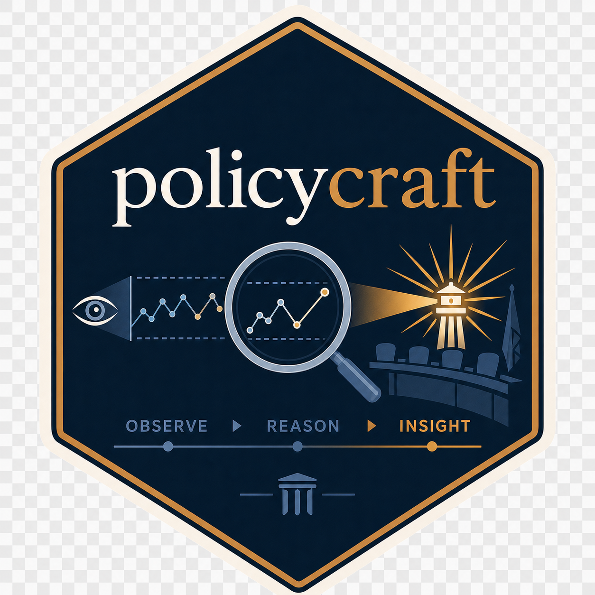

# policycraft 

<!-- badges: start -->
[](https://github.com/danswart/policycraft/actions/workflows/R-CMD-check.yaml)
[](https://lifecycle.r-lib.org/articles/stages.html#experimental)
<!-- badges: end -->

**Observe. Reason. Insight.**

`policycraft` is an R toolkit for policy analysts to progressively
examine longitudinal system data and translate the observations
into insight that may be useful to decision-makers who are responsible
for the system under review. 

It is designed for analysts advising civic boards, public bodies, and
other decision-makers—and for analysts who share its emphasis on
temporal order, system behavior, non-random patterns, and careful
interpretation.

The charts are tools. Insight is the product.


## Analytical stance

Most systems are affected by many forces creating up-and-down variation
in the measures observed. It is the job of the Policy Analyst to
estimate what those 'ups' and 'downs' probably mean, within the context
of earlier outputs.  This simply cannot be done if the data are not
assembled in date/time order for analysis.

Once data are assembled in the order of their occurance the Longitudinal
tool allows the Policy Analyst to filter the data into the desired
groupings. Then, to progressively examine the selected output with a Run
Chart, a Line Chart, a Bar Chart and, finally, with an Expectation Chart
(trended or untrended).  I call it an Expectation Chart because it will
establish what the reasonable expectations of the process output should
be. 

Placing the data on an Expectation Chart (aka
Control Chart, or Process Behavior Chart) allows the analyst to
estimate:

1. Have system outputs in the past been stable (predictable within the
empirically estimated limits provided by the chart). When the output
moves up and down without a single large 'cause' predominating, it will appear to move randomly between the upper and lower expectaton limits. and remain predictable within limits.

An expectation chart  helps an analyst determine whether the observed
pattern remains consistent with the routine system established before
the policy or whether the data contain evidence that warrants
investigation.

A signal does not identify a cause specifically. but can often point to
one based on when the unusual pattern becomes apparent. It does not
prove that a policy worked or failed. It is a reason to investigate the
system, combine the evidence with institutional and policy knowledge,
and communicate uncertainty honestly.

## Installation

```r
# install.packages("pak")
pak::pak("danswart/policycraft")
```

## Launch the longitudinal-analysis tool

```r
library(policycraft)
launch_longitudinal()
```

The application accepts CSV, Excel, and RDS files and provides column mapping,
dynamic filtering, run and line charts, trended and untrended expectation
charts, cohort analysis, autocorrelation diagnostics, and chart exports.

### Expectation-chart input requirements

An expectation chart must contain one temporally ordered process series with
no more than one observation per date. Analysis-ready files should include a
stable `series_id`; filter it to exactly one value before opening the
Expectation Chart tab. The app rejects multi-series or duplicate-date inputs
instead of calculating moving ranges across unrelated grades, subjects,
organizations, standards, or student groups.

When **Recalculate Limits** is enabled, the observations before the selected
date establish the original center line and expectation limits. Those frozen
baseline limits are then used to evaluate the later observations. Explicit
missing periods remain gaps and interrupt moving-range calculations; they are
not removed, converted to zero, interpolated, or silently bridged.

## Use the calculation functions directly

```r
library(policycraft)

example_data <- data.frame(
  year = 2015:2024,
  measure = c(10, 11, 9, 12, 10, 11, 10, 19, 20, 21)
)

expectation_chart_data(example_data, year, measure)
longitudinal_summary(example_data, year, measure)

# Create the package's standardized expectation chart in the plot pane
plot_expectation_chart(example_data, year, measure)
```

## Observe → Reason → Insight

1. **Observe** the measurements in temporal order and understand their source.
2. **Reason** about stability, direction, limits, runs, data quality, and
   alternative explanations.
3. **Develop insight** by combining the analytical evidence with policy goals,
   institutional context, values, constraints, trade-offs, and implementation
   knowledge.

Software does not make policy recommendations. Analysts do.

## Documentation

- `vignette("longitudinal-analysis", package = "policycraft")`
- `?policycraft`
- `?expectation_chart_data`
- `?plot_expectation_chart`
- `?launch_longitudinal`

## Development status

This package is experimental and is hosted on GitHub rather than submitted to
CRAN. Interfaces may evolve as additional policy-analysis tools are added.

## License

MIT © 2026 Dan Swart
