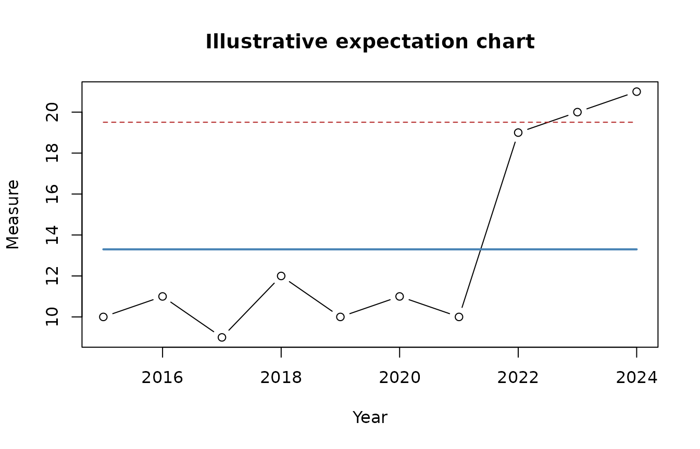

# Longitudinal Analysis: From Observation to Policy Insight

## The analytical purpose

Policy analysts often receive a series of measurements and are asked
whether conditions are improving, worsening, or responding to a policy
change. A table of averages or a comparison between two selected years
can conceal the order in which observations occurred. Longitudinal
analysis begins by preserving that order.

`policycraft` organizes the work as **Observe → Reason → Insight**:

- **Observe:** establish what was measured, how, when, and under which
  system.
- **Reason:** examine temporal patterns, predictable limits, runs,
  direction, data quality, and plausible alternative explanations.
- **Insight:** explain what the evidence supports, what it does not
  support, and what decision-makers may reasonably investigate or
  consider next.

The expectation chart is one tool in this process. It is not the
product. The product is the analyst’s carefully qualified policy
insight.

## Routine and non-random behavior

Most systems are influenced by many small forces. Measurements from such
a system fluctuate, even when no important change has occurred. An
expectation chart estimates a center and limits from the sequential
behavior of the data. Observations within those limits may look
irregular while remaining consistent with the routine system.

Some patterns warrant investigation—for example, an observation beyond
an expectation limit or a sufficiently long run on one side of the
center. These signals indicate that the pattern is difficult to explain
as routine behavior alone. They do not identify the responsible force
and do not establish that a particular policy caused the pattern.

## Prepare longitudinal data

``` r

policy_data <- data.frame(
  year = 2015:2024,
  measure = c(10, 11, 9, 12, 10, 11, 10, 19, 20, 21),
  jurisdiction = "Example Board"
)

prepared <- as_policy_data(policy_data, year, measure)
prepared[, c("date", "value", "jurisdiction")]
#> # A tibble: 10 × 3
#>    date       value jurisdiction 
#>    <date>     <dbl> <chr>        
#>  1 2015-01-01    10 Example Board
#>  2 2016-01-01    11 Example Board
#>  3 2017-01-01     9 Example Board
#>  4 2018-01-01    12 Example Board
#>  5 2019-01-01    10 Example Board
#>  6 2020-01-01    11 Example Board
#>  7 2021-01-01    10 Example Board
#>  8 2022-01-01    19 Example Board
#>  9 2023-01-01    20 Example Board
#> 10 2024-01-01    21 Example Board
```

The explicit date and value selections are intentional. Real policy
files can contain multiple dates, targets, denominators, estimates, and
subgroup values. The analyst—not an automatic guess—should determine
which fields answer the question being considered.

## Calculate an untrended expectation chart

``` r

chart_data <- expectation_chart_data(policy_data, year, measure)
chart_data[, c(
  "date", "value", "center", "lower_limit", "upper_limit",
  "outside_limits"
)]
#> # A tibble: 10 × 6
#>    date       value center lower_limit upper_limit outside_limits
#>    <date>     <dbl>  <dbl>       <dbl>       <dbl> <lgl>         
#>  1 2015-01-01    10   13.3        7.09        19.5 FALSE         
#>  2 2016-01-01    11   13.3        7.09        19.5 FALSE         
#>  3 2017-01-01     9   13.3        7.09        19.5 FALSE         
#>  4 2018-01-01    12   13.3        7.09        19.5 FALSE         
#>  5 2019-01-01    10   13.3        7.09        19.5 FALSE         
#>  6 2020-01-01    11   13.3        7.09        19.5 FALSE         
#>  7 2021-01-01    10   13.3        7.09        19.5 FALSE         
#>  8 2022-01-01    19   13.3        7.09        19.5 FALSE         
#>  9 2023-01-01    20   13.3        7.09        19.5 TRUE          
#> 10 2024-01-01    21   13.3        7.09        19.5 TRUE
```

The function estimates sigma from the average moving range of successive
observations. Its limits describe the baseline represented by the
supplied data. They are not performance standards, desired targets,
confidence intervals, or acceptable-policy boundaries.

``` r

plot(
  chart_data$date,
  chart_data$value,
  type = "b",
  xlab = "Year",
  ylab = "Measure",
  main = "Illustrative expectation chart"
)
lines(chart_data$date, chart_data$center, col = "steelblue", lwd = 2)
lines(chart_data$date, chart_data$upper_limit, col = "firebrick", lty = 2)
lines(chart_data$date, chart_data$lower_limit, col = "firebrick", lty = 2)
```



## Examine runs

``` r

chart_data$run_signal <- detect_runs(chart_data$value, chart_data$center)
chart_data[, c("date", "value", "outside_limits", "run_signal")]
#> # A tibble: 10 × 4
#>    date       value outside_limits run_signal
#>    <date>     <dbl> <lgl>          <lgl>     
#>  1 2015-01-01    10 FALSE          FALSE     
#>  2 2016-01-01    11 FALSE          FALSE     
#>  3 2017-01-01     9 FALSE          FALSE     
#>  4 2018-01-01    12 FALSE          FALSE     
#>  5 2019-01-01    10 FALSE          FALSE     
#>  6 2020-01-01    11 FALSE          FALSE     
#>  7 2021-01-01    10 FALSE          FALSE     
#>  8 2022-01-01    19 FALSE          FALSE     
#>  9 2023-01-01    20 TRUE           FALSE     
#> 10 2024-01-01    21 TRUE           FALSE
```

By default,
[`detect_runs()`](https://danswart.github.io/policycraft/reference/detect_runs.md)
marks the eighth and subsequent observations in a run on the same side
of the center. A value exactly on the center and a missing value
interrupt a run. Rules should be declared before interpreting the chart;
they should not be changed repeatedly until the analyst finds a
preferred story.

## Decide whether an expectation chart is suitable

Before relying on either a trended or untrended chart, ask:

1.  Are observations comparable over time?
2.  Did definitions, collection procedures, denominators, or reporting
    coverage change?
3.  Is temporal spacing meaningful and correctly represented?
4.  Does aggregation conceal materially different subgroups or
    jurisdictions?
5.  Is a sustained trend substantively plausible?
6.  Would a trended chart describe a stable direction, or merely
    normalize a policy-relevant change that should be investigated?

Run, line, bar, and cohort charts help the analyst inspect direction,
composition, gaps, and grouping structure before selecting an
expectation-chart form.

## Move from signal to insight

``` r

longitudinal_summary(policy_data, year, measure)
#> # A tibble: 1 × 10
#>   observations first_date last_date  center lower_limit upper_limit
#>          <int> <date>     <date>      <dbl>       <dbl>       <dbl>
#> 1           10 2015-01-01 2024-01-01   13.3        7.09        19.5
#> # ℹ 4 more variables: average_moving_range <dbl>, outside_limit_signals <int>,
#> #   run_signals <int>, investigate <lgl>
```

The summary’s `investigate` value is deliberately modest. Investigation
may include checking data quality, identifying changes in the system,
consulting program staff and affected communities, examining
implementation timelines, and testing alternative explanations.

A responsible policy briefing distinguishes:

- **Observation:** what the ordered measurements show.
- **Analytical reasoning:** why the pattern does or does not appear
  routine.
- **Context:** what institutional evidence and policy knowledge add.
- **Uncertainty:** what remains unknown or weakly supported.
- **Insight:** what decision-makers should understand or investigate.

The software supports the first two steps. The analyst is responsible
for the rest.
